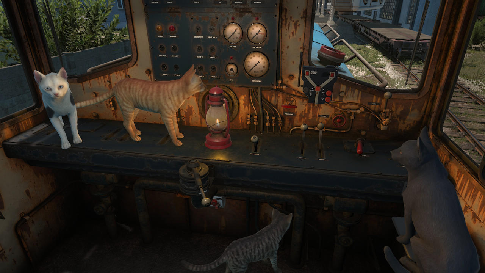
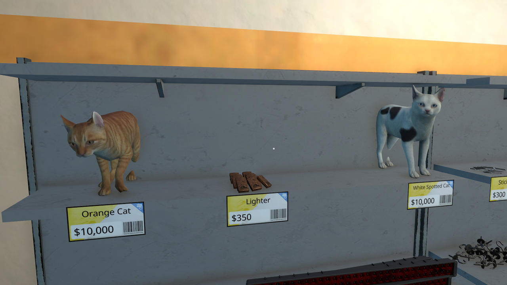

# Cat Items Animated

This mod adds animated cat companions (items) to Derail Valley.

It creates custom items with a basic static model, then replaces them with real animated cats at runtime.
This mod reuses the default Derail Valley cats.

You cannot adopt cats off the street, you have to acquire them from the shop.

## How to install

1. install Unity Mod Manager(UMM)
2. install [Custom Item Mod](https://github.com/t0stiman/dv_custom_item_mod)
3. download this mods zip from the [Releases](https://github.com/BJNick/DVModCatItems/releases/tag/v0.0.3) tab and manually extract it into DV's mod folder

After installing, you can buy the items in the shops.
